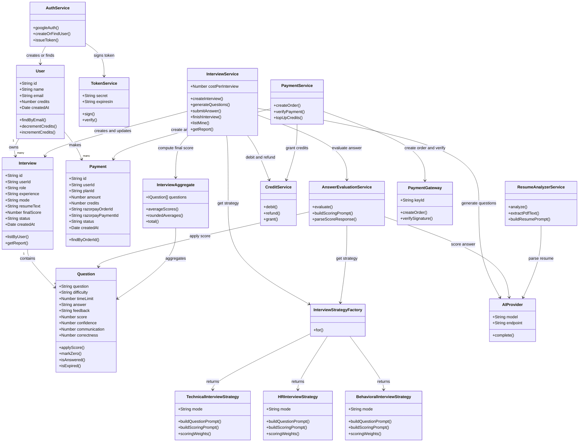

# InterviewIQ — Class Diagram

```mermaid
classDiagram

class User {
  +String id
  +String name
  +String email
  +Number credits
  +Date createdAt
  +findByEmail()
  +decrementCredits()
  +incrementCredits()
}

class Interview {
  +String id
  +String userId
  +String role
  +String experience
  +String mode
  +String resumeText
  +Number finalScore
  +String status
  +Date createdAt
  +listByUser()
  +getReport()
}

class Question {
  +String question
  +String difficulty
  +Number timeLimit
  +String answer
  +String feedback
  +Number score
  +Number confidence
  +Number communication
  +Number correctness
  +applyScore()
  +markZero()
  +isAnswered()
  +isExpired()
}

class Payment {
  +String id
  +String userId
  +String planId
  +Number amount
  +Number credits
  +String razorpayOrderId
  +String razorpayPaymentId
  +String status
  +Date createdAt
  +findByOrderId()
}

class AuthService {
  +googleAuth()
  +createOrFindUser()
  +issueToken()
}

class TokenService {
  +String secret
  +String expiresIn
  +sign()
  +verify()
}

class InterviewService {
  +Number costPerInterview
  +createInterview()
  +generateQuestions()
  +submitAnswer()
  +finishInterview()
  +listMine()
  +getReport()
}

class AnswerEvaluationService {
  +evaluate()
  +buildScoringPrompt()
  +parseScoreResponse()
}

class ResumeAnalyzerService {
  +analyze()
  +extractPdfText()
  +buildResumePrompt()
}

class CreditService {
  +debit()
  +refund()
  +grant()
}

class PaymentService {
  +createOrder()
  +verifyPayment()
  +topUpCredits()
}

class InterviewAggregate {
  +IQuestion[] questions
  +averageScores()
  +roundedAverages()
  +total()
}

class InterviewStrategyFactory {
  +for()
}

class TechnicalInterviewStrategy {
  +String mode
  +buildQuestionPrompt()
  +buildScoringPrompt()
  +scoringWeights()
}

class HRInterviewStrategy {
  +String mode
  +buildQuestionPrompt()
  +buildScoringPrompt()
  +scoringWeights()
}

class BehavioralInterviewStrategy {
  +String mode
  +buildQuestionPrompt()
  +buildScoringPrompt()
  +scoringWeights()
}

class AIProvider {
  +String model
  +String endpoint
  +complete()
}

class PaymentGateway {
  +String keyId
  +createOrder()
  +verifySignature()
}

User "1" --> "many" Interview : owns
User "1" --> "many" Payment : makes
Interview "1" --> "many" Question : contains
AuthService --> User : creates or finds
AuthService --> TokenService : signs token
InterviewService --> Interview : creates and updates
InterviewService --> CreditService : debit and refund
InterviewService --> AnswerEvaluationService : evaluate answer
InterviewService --> InterviewStrategyFactory : get strategy
InterviewService --> AIProvider : generate questions
InterviewService --> InterviewAggregate : compute final score
AnswerEvaluationService --> AIProvider : score answer
AnswerEvaluationService --> InterviewStrategyFactory : get strategy
AnswerEvaluationService --> Question : apply score
ResumeAnalyzerService --> AIProvider : parse resume
PaymentService --> PaymentGateway : create order and verify
PaymentService --> CreditService : grant credits
PaymentService --> Payment : create and update
InterviewAggregate --> Question : aggregates
InterviewStrategyFactory --> TechnicalInterviewStrategy : returns
InterviewStrategyFactory --> HRInterviewStrategy : returns
InterviewStrategyFactory --> BehavioralInterviewStrategy : returns
```
