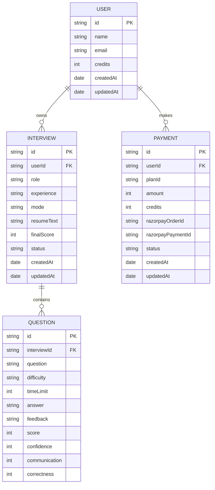

# InterviewIQ — ER Diagram

```mermaid
erDiagram

    USER {
        string id PK
        string name
        string email
        int credits
        date createdAt
        date updatedAt
    }

    INTERVIEW {
        string id PK
        string userId FK
        string role
        string experience
        string mode
        string resumeText
        int finalScore
        string status
        date createdAt
        date updatedAt
    }

    QUESTION {
        string id PK
        string interviewId FK
        string question
        string difficulty
        int timeLimit
        string answer
        string feedback
        int score
        int confidence
        int communication
        int correctness
    }

    PAYMENT {
        string id PK
        string userId FK
        string planId
        int amount
        int credits
        string razorpayOrderId
        string razorpayPaymentId
        string status
        date createdAt
        date updatedAt
    }

    USER ||--o{ INTERVIEW : "owns"
    USER ||--o{ PAYMENT : "makes"
    INTERVIEW ||--o{ QUESTION : "contains"
```
