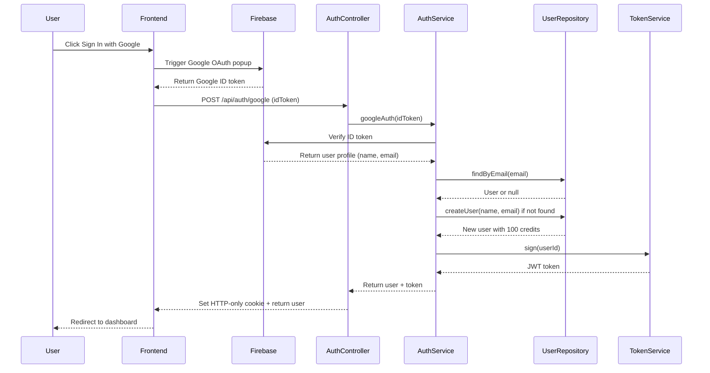
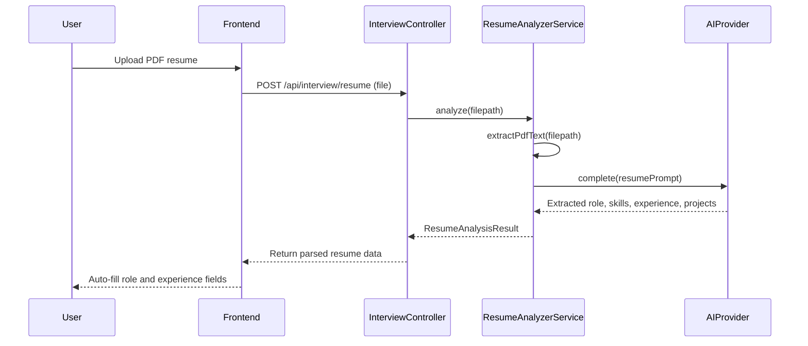
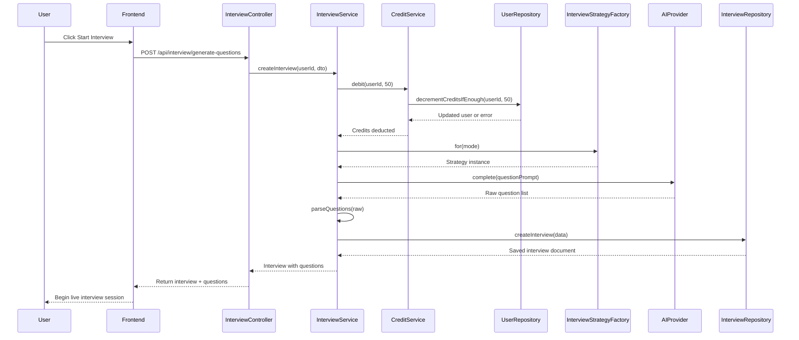
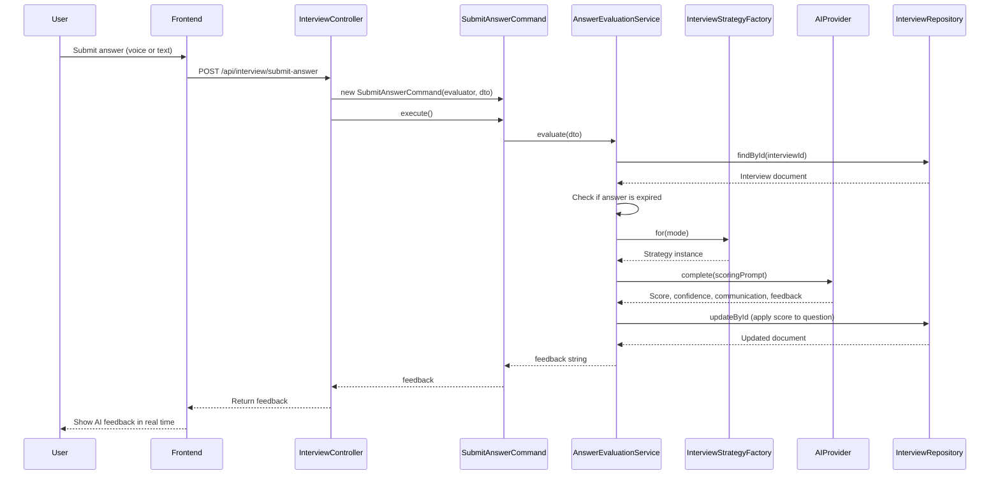
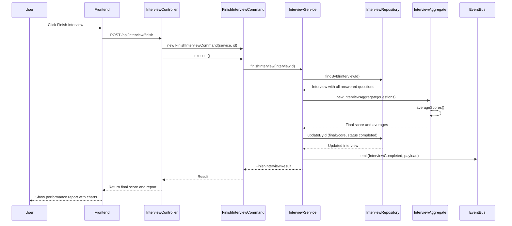
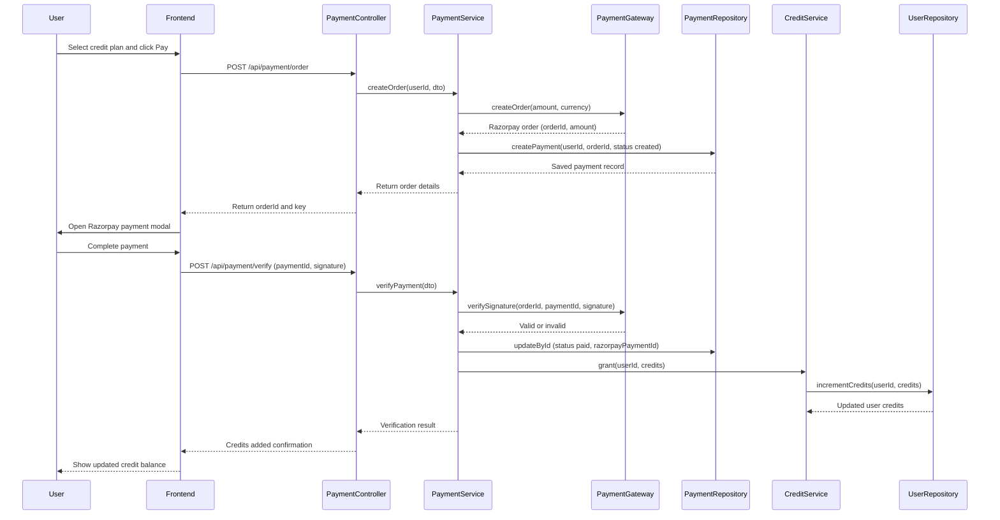

# InterviewIQ — Sequence Diagrams

---

## 1. Google Authentication Flow

---

## 2. Resume Upload and Analysis Flow

---

## 3. Interview Question Generation Flow

---

## 4. Answer Submission and Evaluation Flow

---

## 5. Finish Interview and Report Generation Flow

---

## 6. Payment and Credit Top-Up Flow

