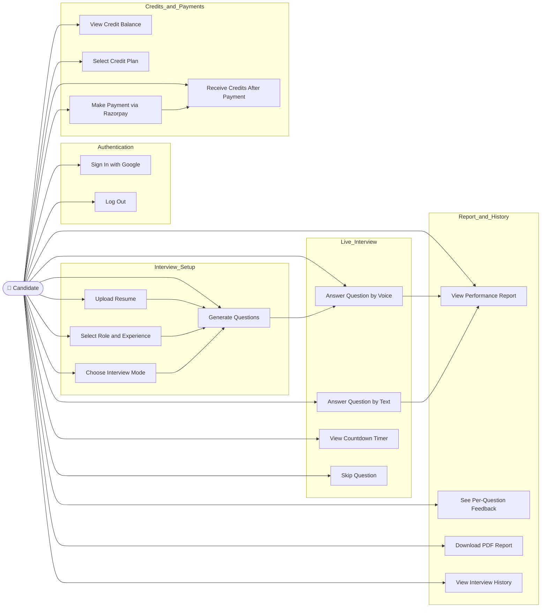

# InterviewIQ — Use Case Diagram

```mermaid
flowchart LR

    Candidate(["👤 Candidate"])

    subgraph Authentication
        UC1["Sign In with Google"]
        UC2["Log Out"]
    end

    subgraph Interview_Setup
        UC3["Upload Resume"]
        UC4["Select Role and Experience"]
        UC5["Choose Interview Mode"]
        UC6["Generate Questions"]
    end

    subgraph Live_Interview
        UC7["Answer Question by Voice"]
        UC8["Answer Question by Text"]
        UC9["View Countdown Timer"]
        UC10["Skip Question"]
    end

    subgraph Report_and_History
        UC11["View Performance Report"]
        UC12["See Per-Question Feedback"]
        UC13["Download PDF Report"]
        UC14["View Interview History"]
    end

    subgraph Credits_and_Payments
        UC15["View Credit Balance"]
        UC16["Select Credit Plan"]
        UC17["Make Payment via Razorpay"]
        UC18["Receive Credits After Payment"]
    end

    Candidate --> UC1
    Candidate --> UC2
    Candidate --> UC3
    Candidate --> UC4
    Candidate --> UC5
    Candidate --> UC6
    Candidate --> UC7
    Candidate --> UC8
    Candidate --> UC9
    Candidate --> UC10
    Candidate --> UC11
    Candidate --> UC12
    Candidate --> UC13
    Candidate --> UC14
    Candidate --> UC15
    Candidate --> UC16
    Candidate --> UC17
    Candidate --> UC18

    UC3 --> UC6
    UC4 --> UC6
    UC5 --> UC6
    UC6 --> UC7
    UC7 --> UC11
    UC8 --> UC11
    UC17 --> UC18
```
